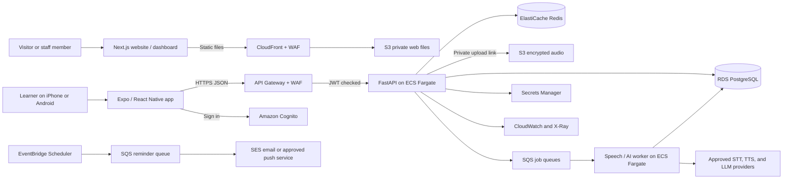
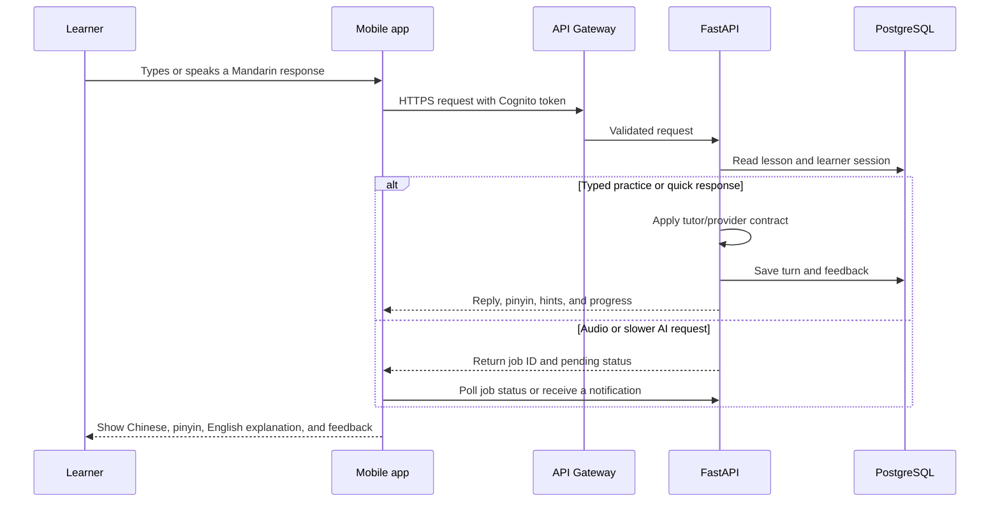
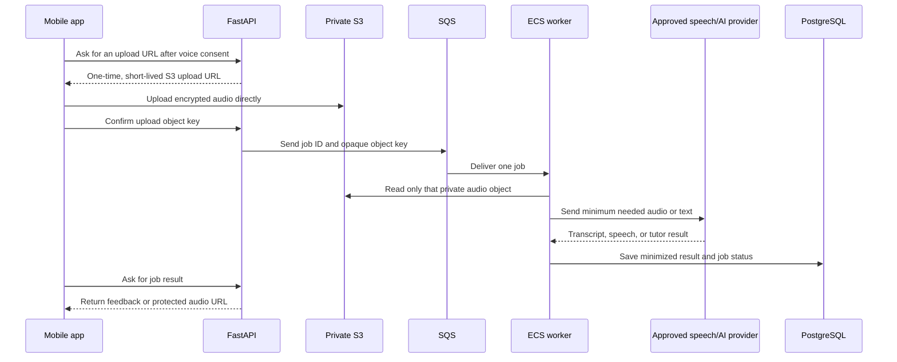

# Mengo technical guide: what talks to what

This guide explains the Mengo system in plain English. The codebase is a local MVP today: it uses a local database and deterministic mock AI/speech responses. The AWS sections describe the production design that replaces those local pieces after security, privacy, cost, and language-quality approval.

## The system at a glance

The learner uses the mobile app. The app signs the learner in, then sends normal HTTPS requests to the API. The API owns the learner's data and decides what is allowed. Long-running voice and AI work is sent to a queue so a slow provider does not make the app appear frozen. The worker completes that work and saves the result for the app to retrieve.

## Why this stack was selected

| Choice | Why it fits Mengo | What it replaces or avoids |
| --- | --- | --- |
| React Native + Expo | One TypeScript mobile codebase can reach iOS and Android. Expo speeds up device testing, builds, updates, and App Store/Play Store delivery. | Building and maintaining two entirely separate native apps at the MVP stage. |
| TypeScript | It catches mismatched API fields before an app reaches a learner, and lets the web and mobile teams use the same language. | JavaScript-only code, where many data-shape errors appear later at runtime. |
| Next.js | It provides a fast marketing site and a web dashboard with React, static pages, and good SEO. | Maintaining a separate web framework or server-rendering infrastructure before it is needed. |
| FastAPI | It is a concise Python API framework with typed request validation and automatic API documentation. Python also works well for future learning, language, and AI services. | Duplicating business rules in every client or writing raw HTTP handling. |
| PostgreSQL | It safely holds users, progress, vocabulary, subscriptions, and audit-ready records while many people use the app at once. | SQLite, which is intentionally used only for local development. |
| Redis | It quickly stores temporary information such as rate-limit counters, short-lived cache entries, and worker coordination. | Putting temporary high-churn state in the main database. |
| S3 + SQS | S3 securely holds large audio files; SQS reliably holds small work messages. Each service does the job it is designed for. | Sending audio through the API process or keeping long-running audio work inside a learner's request. |
| ECS Fargate | It runs the existing FastAPI/Python containers without managing servers. API containers and background workers can scale independently. | Running virtual machines or forcing the entire backend into short-lived functions. |
| Cognito | It supplies managed sign-up, sign-in, password recovery, federation, and signed identity tokens. | A custom password database and authentication system. |
| AWS managed services | RDS, S3, SQS, CloudWatch, WAF, KMS, Secrets Manager, and Backup reduce operational work and integrate with the AWS network/security model. | Operating databases, queues, encryption, logs, and backups from scratch. |

## The applications

### Mobile learner app: React Native + Expo

`apps/mobile` is the application that learners install. It shows onboarding, lessons, vocabulary, review cards, progress, and the subscription screen. It keeps only the information it needs to display the current experience; it does not directly access the database, Redis, Secrets Manager, or provider keys.

In production, Cognito signs the learner in and gives the app a short-lived identity token. The app attaches that token to HTTPS calls to API Gateway. API Gateway verifies it before FastAPI receives the request. This prevents one learner from pretending to be another learner simply by changing a user ID in the app.

Expo/EAS remains responsible for building and signing iOS and Android packages. It is not the production backend. A mobile app must never contain AWS long-lived credentials or an OpenAI, Deepgram, or ElevenLabs key because anyone who installs the app can inspect its contents.

### Website and dashboard: Next.js

`apps/web` is for the public product pages and, during local development, a demo dashboard. Next.js creates static HTML, CSS, and JavaScript files. In production, CI uploads those files to a private S3 bucket. CloudFront is the public front door: it caches the files close to visitors and retrieves them from S3 without making the bucket public.

For ordinary product pages, a browser does not need to call FastAPI. For signed-in web features added later, the browser would use the same Cognito and API Gateway path as the mobile app. Real staff administration needs separate authorization and SSO; the current local dashboard is not a production admin system.

### API: FastAPI

`apps/api` is the system's coordinator. It accepts a small JSON request, checks that it has valid fields, identifies the learner, applies business rules, reads or updates data, and returns a JSON response. For example, when a learner saves a word, the API checks the request, writes the word to PostgreSQL, creates or updates its review schedule, records an allowlisted event, and returns the saved item.

FastAPI is deliberately the only component that makes business decisions about learner data. That keeps rules consistent whether requests come from the mobile app, website, or a future partner integration. Its OpenAPI documentation gives frontend developers an exact contract for each endpoint.

### Shared TypeScript types

`packages/shared-types` defines client-side request and response shapes. The mobile and web apps import those definitions so they agree on names such as `scenario_id`, `pinyin`, and `completed_lessons`. FastAPI still validates every request on the server: types help developers, but they do not protect an internet-facing API from malformed requests.

## A normal lesson conversation

For the current local MVP, the provider contract uses deterministic mock responses, so the tests are repeatable and no paid service is contacted. In production, the API creates a job for expensive or slower work rather than waiting for it inside the learner's request.

## Voice and AI: how the asynchronous path works

Audio is uploaded directly to S3 because the API should not become a large-file relay. The upload URL is short-lived and limited to one learner/object. The SQS message contains an opaque object key and job ID, not the recording or full transcript. If a provider is slow, SQS retries within defined limits; repeated failures go to a dead-letter queue for staff investigation using redacted identifiers.

The worker uses exactly one approved provider set for that learner/session. It must not silently send content to a fallback company, because that could violate voice consent or data-residency commitments. If the learner has consented to a tested fallback, the incident policy may select it; otherwise the app shows a clear retryable error and still displays typed learning content where possible.

## LLM, STT, and TTS roles

| Component | Plain-English job | Recommended initial provider | Other configured choices |
| --- | --- | --- |
| LLM | Reads the bounded scenario and learner text, then creates a helpful Mandarin tutor response and explanation. | OpenAI GPT | Anthropic Claude, Google Gemini, Amazon Bedrock models |
| STT | Turns a learner's Mandarin recording into text so the app can show what it heard. | Deepgram | OpenAI transcription, Google Cloud Speech-to-Text, AWS Transcribe |
| TTS | Turns an approved Chinese sentence into spoken Mandarin audio. | ElevenLabs | OpenAI TTS, Google Cloud Text-to-Speech, Amazon Polly |
| Pronunciation scoring | Provides cautious, assistive feedback against a confirmed transcript. | A separately evaluated provider/adapter | Never claim this is an objective language assessment. |

`app/providers.py` is the boundary around these vendors. The rest of the app asks for "transcribe this," "say this sentence," or "reply to this turn"; it does not know which vendor implements it. This makes switching a reviewed provider much safer and makes local tests use mock versions. A provider name in an environment variable cannot turn on paid requests: live mode intentionally fails until a reviewed adapter is implemented.

## Data, security, and operations

### Database and cache

PostgreSQL is the source of truth. It stores learner accounts, profiles, lesson sessions, vocabulary, review schedules, purchases/entitlements, and minimum necessary AI results. It runs in private network subnets and accepts connections only from the API/worker security groups. AWS Backup creates recoverable backups; migrations replace the local MVP's automatic table creation.

Redis contains replaceable short-lived information, such as "this account has made five requests this minute." If Redis is lost, Mengo can rebuild the data; if PostgreSQL is lost, it cannot. That distinction prevents accidental use of Redis as a learner-data database.

### Identity and access

Cognito proves who has signed in. API Gateway checks the resulting JWT before forwarding a request. FastAPI then uses the token's subject to look up the correct learner record and enforce account ownership. Staff-only operations need separate roles and authentication, not a hidden web route.

Secrets Manager stores vendor API keys and similar runtime secrets. ECS retrieves them using a narrow task role. Bedrock, Transcribe, and Polly use that IAM role directly rather than any static AWS key. The web, mobile app, Git repository, logs, and database must never contain secret values.

### Monitoring and reminders

CloudWatch collects redacted service logs, metrics, and alarms. X-Ray helps trace one request through API Gateway, FastAPI, queues, and workers. Logs may include a request/job ID, status, timing bucket, and provider family; they must not include recordings, transcript content, prompts, tokens, payment details, or credentials.

EventBridge Scheduler creates a reminder job at the requested time. An SQS reminder queue separates scheduling from delivery. A worker may then send email through SES or a consent-aware approved mobile-push integration. This design supports retries and opt-outs without putting notification delivery inside the API request.

## Local MVP versus production

| Area | Local development | Production AWS design |
| --- | --- | --- |
| Identity | `X-Demo-User` header | Cognito JWT, API Gateway authorization, roles |
| Database | SQLite file | Multi-AZ RDS PostgreSQL with migrations and backups |
| AI and speech | Deterministic mocks | Explicitly reviewed provider adapters and consent |
| Audio | No recording | Private SSE-KMS S3, presigned uploads, lifecycle deletion |
| Background work | In-process/mock flow | SQS, dead-letter queues, ECS workers |
| Rate limits | Per-process memory | Redis-backed distributed limits plus WAF/API Gateway controls |
| Website | `next dev` | Static export in private S3 through CloudFront |
| Secrets | Blank local environment variables | Secrets Manager and ECS IAM task roles |

The local MVP is intentionally not a miniature production environment. Its purpose is safe product development and repeatable tests. Production activation requires the explicit controls in [production-readiness.md](production-readiness.md) and the AWS design in [infrastructure/aws/README.md](../infrastructure/aws/README.md).
