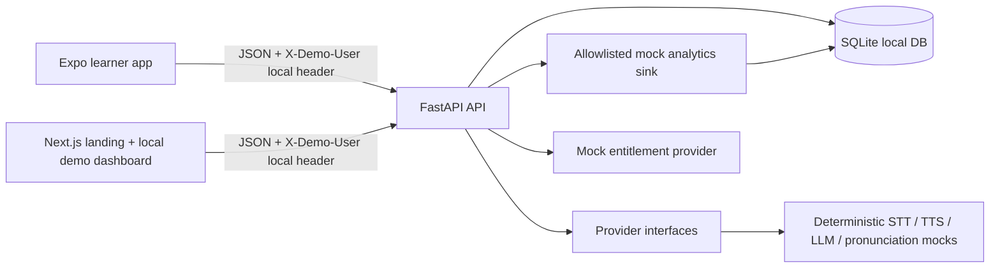
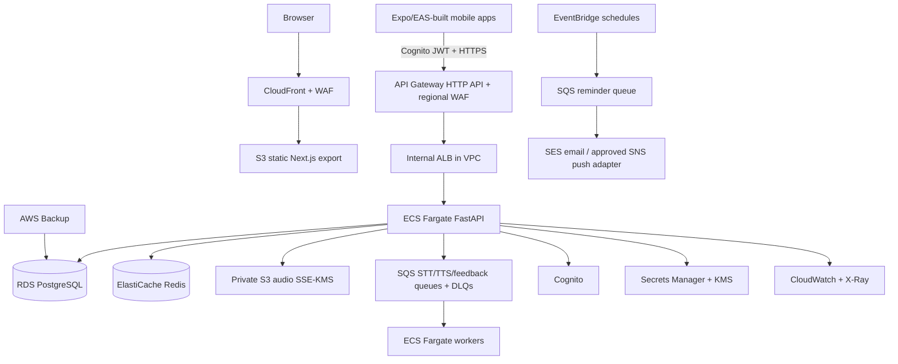

# Architecture

## Local MVP

This local flow intentionally uses SQLite and deterministic mocks. It remains the required development and test mode even after a production cloud environment is introduced.

## AWS production target

Production targets AWS, documented in detail in [infrastructure/aws/README.md](../infrastructure/aws/README.md). The website is a static Next.js export served by **CloudFront + private S3**, while FastAPI runs as a containerized service behind **API Gateway HTTP API → VPC Link → internal ALB → ECS Fargate**. This fits the existing FastAPI runtime and supports separate queue workers for media/feedback work.

All application, database, Redis, and media workloads reside in VPC private subnets with restrictive security groups. Only CloudFront and API Gateway are public. AWS WAF applies separate CloudFront and regional API Gateway Web ACLs. The Expo/EAS builds remain client applications: they authenticate with Cognito and call AWS API endpoints; they never contain AWS credentials or direct database access.

## Component responsibilities

| Component | Responsibility | Explicit non-goal |
| --- | --- | --- |
| `apps/mobile` | Onboarding, scenario practice, transcript, feedback, words, review, paywall UI | Capturing or storing real microphone audio |
| `apps/web` | Public product explanation/pricing and aggregate local-demo dashboard | Real admin authorization |
| `apps/api` | Validation, domain rules, persistence, seed data, local demo identity | Production identity, payments, or provider integrations |
| `packages/shared-types` | Client-facing API shapes | Runtime schema validation |
| `app/providers.py` | Provider-neutral STT, TTS, LLM, pronunciation contracts, selection validation, and mocks | Activating live services silently |
| `app/analytics.py` | Allowlist enforcement and local event storage | Transmitting content or personal data |
| `app/subscriptions.py` | Entitlement contract and demo entitlement | Payment acceptance or receipt validation |

## Local data lifecycle

FastAPI creates tables via `Base.metadata.create_all()` at startup and seeds four scenarios. This is appropriate only for a disposable local SQLite MVP. The account-deletion demo route removes domain records associated with the demo user, then stores only a content-free deletion event.

## Provider boundary

`MENGO_AI_PROVIDER_MODE=mock` is the default and the only implementation shipped. Production defaults are OpenAI GPT for LLM, Deepgram for STT, and ElevenLabs for TTS; Anthropic Claude, Google Gemini/Cloud Speech/Text-to-Speech, and AWS Bedrock/Transcribe/Polly are selectable alternatives. Selecting `live` validates the selected provider configuration and then fails closed because no reviewed adapter is shipped. A production adapter must be explicitly written; it must never silently fall back to or activate a provider. Before any STT, TTS, LLM, or pronunciation service is enabled, conduct privacy, consent, cost, security, retention, regional-transfer, and prompt-injection reviews. See [provider design](providers.md).

## Production service responsibilities

| AWS service | Mengo responsibility |
| --- | --- |
| CloudFront + S3 | Serve the static Next.js export with TLS, edge caching, WAF, and no public bucket access. |
| API Gateway + ECS Fargate | Authorize and route API traffic to the FastAPI service; run API and asynchronous worker containers separately. |
| RDS PostgreSQL + AWS Backup | Production system of record, managed backups, recovery testing, and migration target from SQLite. |
| ElastiCache Redis | Distributed rate limiting, cache, and short-lived coordination—not durable learning data. |
| Cognito + Secrets Manager | JWT identity at the API boundary and runtime secret injection without shipping secret values. |
| S3 + SQS | Encrypted private audio and bounded asynchronous STT/TTS/feedback jobs with DLQs. |
| CloudWatch + X-Ray | Redacted logs, alarms, metrics, and request/job tracing. |
| EventBridge + SES/SNS | Scheduled reminder requests and consent-gated email/push delivery integrations. |
