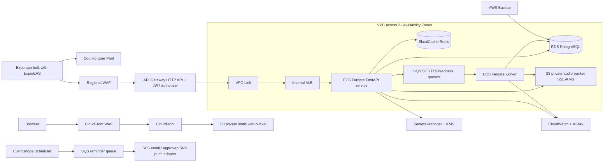

# AWS production target (design only)

This directory documents Mengo's intended AWS production topology. It is an IaC-oriented design, **not a deployment**: it contains no account IDs, credentials, secrets, Terraform state, resource definitions to apply, or live-provider configuration. Local development remains FastAPI + SQLite + deterministic mocks as documented in the root README.

## Chosen target

| Workload | AWS target | Rationale |
| --- | --- | --- |
| Next.js website/admin UI | **S3 static hosting behind CloudFront** | The current Next.js application is statically exported; CloudFront provides TLS, caching, WAF integration, and an inexpensive public edge. Use Amplify only if future previews/SSR are a better fit. |
| FastAPI API and workers | **API Gateway HTTP API → VPC Link → internal ALB → ECS Fargate** | Fargate supports the existing Python runtime, predictable dependency packaging, sustained API traffic, and separate asynchronous worker containers. API Gateway provides JWT authorization, throttling, and a public API boundary. |
| Relational data | **RDS PostgreSQL**, Multi-AZ for production | PostgreSQL replaces local SQLite and supports migration, backup, concurrency, and managed recovery needs. |
| Shared ephemeral state | **ElastiCache Redis** in private subnets | Distributed rate limits, cache, short-lived server sessions if needed, and job coordination. Redis is not the source of truth. |
| Audio objects | **Private S3 bucket with SSE-KMS** | Client uploads use short-lived, scoped presigned URLs; bucket public access is blocked. A lifecycle policy expires raw audio after the approved retention period (initial proposal: 7 days), aborts incomplete uploads after 1 day, and permanently deletes objects requested through account deletion. |
| Identity | **Amazon Cognito User Pools** | Hosted/OIDC federation and JWTs. API Gateway validates JWTs with a Cognito authorizer; the demo header is removed in production. |
| Secrets | **AWS Secrets Manager**, encrypted by KMS | ECS injects reviewed provider credentials at runtime. No keys are baked into images, mobile builds, IaC, or browser bundles. |
| Background work | **SQS queues + DLQs** and ECS Fargate workers | STT, TTS, and feedback requests become asynchronous, retryable jobs. A worker accesses only the necessary audio object and writes the result back to PostgreSQL. |
| Reminders | **EventBridge Scheduler/EventBridge rules → SQS** | Scheduled reminder requests are decoupled from delivery workers, which can use SES for email and an approved SNS mobile-push adapter. |
| Observability | **CloudWatch Logs/Metrics/Alarms and X-Ray** | Structured redacted logs, API/ECS/SQS/RDS alarms, traces, and correlation IDs. Never put audio, transcript text, tokens, or secrets in telemetry. |
| Protection/recovery | **AWS WAF, KMS, VPC, security groups, AWS Backup** | WAF Web ACLs protect both CloudFront and the regional API Gateway; encryption keys, isolated private data services, least-privilege security groups, and tested RDS backups are required. |

## Network and request flow



### VPC and access boundaries

- Use at least two Availability Zones. The internet-facing surface is CloudFront and API Gateway only.
- Put the internal ALB, ECS tasks, RDS, and ElastiCache in private subnets. RDS and Redis have no public IPs.
- Security groups permit API tasks to reach PostgreSQL (5432), Redis (6379), S3 through a gateway endpoint, queues, Secrets Manager, CloudWatch, and reviewed providers through controlled egress. Only the VPC Link/ALB path may reach API tasks.
- Create separate KMS keys or scoped key policies for data, S3 audio, and secrets. Enable S3 Block Public Access, bucket-owner enforcement, versioning only if retention policy allows it, and CloudTrail data-event review for the audio bucket.
- AWS Backup protects RDS with a defined retention, cross-region/cross-account policy where required, restore drills, and recovery objectives approved by the business.

## Async audio and feedback flow

1. An authenticated learner requests a scoped presigned S3 upload URL after giving the required voice consent.
2. The app uploads encrypted audio directly to the private bucket; it never adds audio to analytics or application logs.
3. The API creates a database record and SQS job containing an opaque object key, job ID, and minimal routing metadata—never transcript text in queue metadata.
4. A Fargate worker reads the object, invokes only an approved STT/TTS/pronunciation provider using Secrets Manager credentials, persists minimized results, and deletes temporary provider artifacts where supported.
5. Failed jobs use bounded retries and a DLQ; operations staff investigate using redacted job IDs. Account deletion cancels outstanding jobs and deletes eligible S3 objects and database records.

The existing mock mode is retained for local tests. Production providers must be separately implemented behind the current provider interfaces after privacy, cost, security, data-residency, and prompt-injection review.

See [the provider design](../../docs/providers.md) for the proposed OpenAI GPT/Deepgram/ElevenLabs defaults, Anthropic/Google/AWS-native alternatives, consent boundary, cost and latency controls, and consent-aware fallback policy.

## Terraform-oriented implementation plan

Adopt Terraform with a remote, encrypted state backend in a dedicated platform account only after access controls are approved. Do not run `terraform apply` from this repository until a reviewed environment design exists.

```text
infrastructure/aws/terraform/
  modules/
    network/          # VPC, private subnets, endpoints, security groups
    edge-web/         # S3, CloudFront, public WAF ACL
    api/              # Regional WAF, API Gateway, VPC Link, internal ALB
    compute/          # ECS cluster, API and worker task definitions/services
    data/             # RDS PostgreSQL, Redis, KMS, Backup selections
    media-jobs/       # Private S3 audio, SQS queues and DLQs, IAM roles
    identity/         # Cognito pools, app clients, API authorizer
    observability/    # CloudWatch logs/alarms/dashboards, X-Ray permissions
    notifications/    # EventBridge schedules, queues, SES/SNS integration roles
  environments/
    staging/
    production/
```

Module inputs should be IDs/references created in the same environment, not credentials. Keep secret *values* exclusively in Secrets Manager and expose only secret ARNs to task definitions. Require plan review, policy-as-code/security scanning, immutable image digests, tagged resources, and separate staging/production state before provisioning.

## Delivery and mobile

- Build the mobile client with **Expo/EAS**. The resulting iOS/Android apps interact with Cognito and API Gateway over HTTPS; they do not receive AWS credentials or direct database access.
- Build the static Next.js export in CI, publish it to the private S3 web bucket, and invalidate only changed CloudFront paths.
- Build the FastAPI API and worker images in CI, scan/sign them, publish to ECR, and deploy an immutable image digest to ECS. Run Alembic migrations as a controlled one-off task, not from every API container startup.
- Start with separate AWS accounts or equivalent hard boundaries for development/staging/production. CI uses short-lived OIDC roles with least privilege.

## Explicit non-goals

This design does not provision AWS resources, enable a commercial AI provider, configure live billing, grant browser/mobile AWS credentials, or relax local mock safeguards. Capacity, retention, backup, notification, and regional choices require product, legal, security, and cost approval before implementation.
